# Assignment 1 - HTML & CSS Basics

## Student Information

**Name:** Korganbek Madiyar  
**Group:** IT-2501

## Objective

The main goal of this assignment was to learn the basics of HTML and CSS and create a simple personal webpage.
During this assignment, I worked with HTML structure, headings, paragraphs, lists, images, links, buttons, tables and forms. I also learned how to use CSS for colors, fonts, spacing, positioning and page layout.
Finally, I published the website using GitHub Pages.

# Part 1 - Introduction to HTML

## Step 0 - Basic HTML Structure

I created an HTML webpage with the basic HTML structure, including `DOCTYPE`, `html`, `head`, `title` and `body`.
The page title is "My First Website".

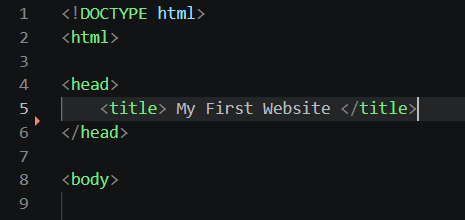

## Step 1 - Structure Text Using HTML Tags

I added headings and a paragraph with information about myself, my course and my group.

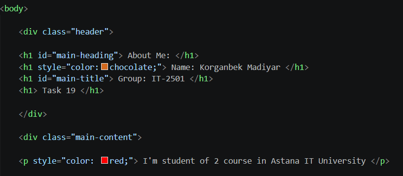

## Step 2 - HTML Lists

I created an ordered list with my hobbies and an unordered list with my favorite websites.

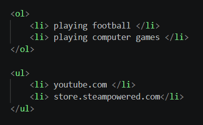

## Step 3 - Images and Links

I added an image and links to websites such as YouTube and GitHub.

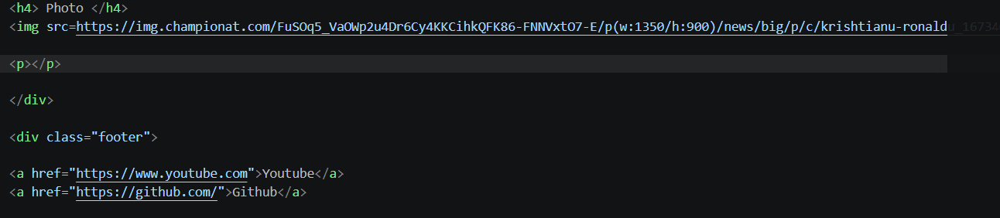

## Step 4 - HTML Button

I added a button with the text "Click Me".

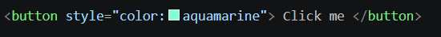

---

# Part 2 - Intermediate HTML

## Step 5 - Tables

I created a table with three columns: Subject, Day and Time. I used it to show my weekly class schedule.

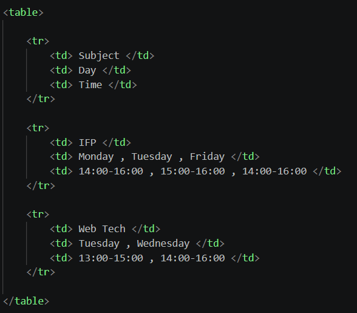

## Step 6 - Table Layout

I created a two-column table layout with a menu and main content.

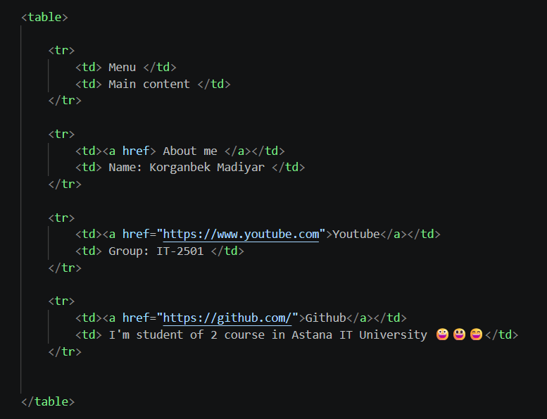

## Step 7 - Emojis

I added three emojis to a paragraph about my mood.

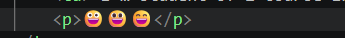

## Step 8 - HTML Form

I created a form with Name, Email, Favorite Color and Submit fields.

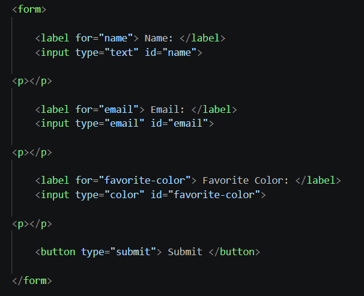

---

# Part 3 - Introduction to CSS

## Step 9 - Introduction to CSS

I added CSS styling to the webpage to change colors, fonts, backgrounds and spacing.

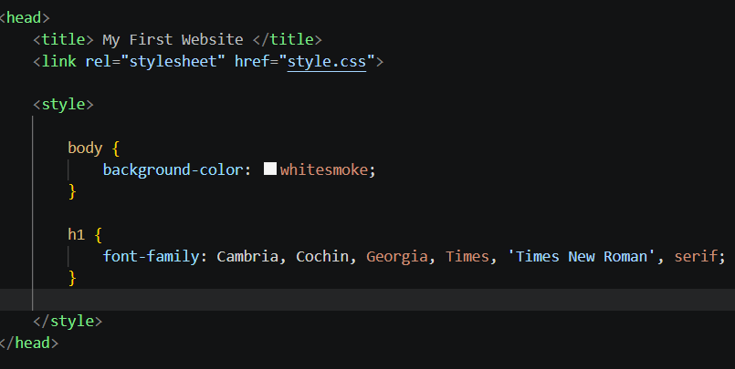

## Step 10 - Inline CSS

I used inline CSS to change the color of a paragraph.

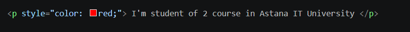

## Step 11 - Internal CSS

I used CSS rules inside the HTML document to style some elements.

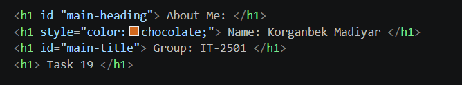

## Step 12 - External CSS

I created an external `style.css` file and connected it to the HTML file.

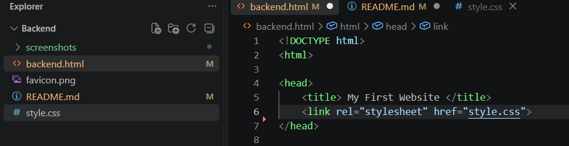

## Step 13 - CSS Selectors

I used element selectors, class selectors and ID selectors in my CSS.

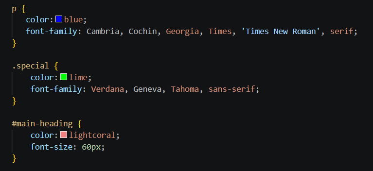

## Step 14 - Classes and IDs

I created the `.highlight` class for multiple elements and the `#main-heading` ID for the main heading.

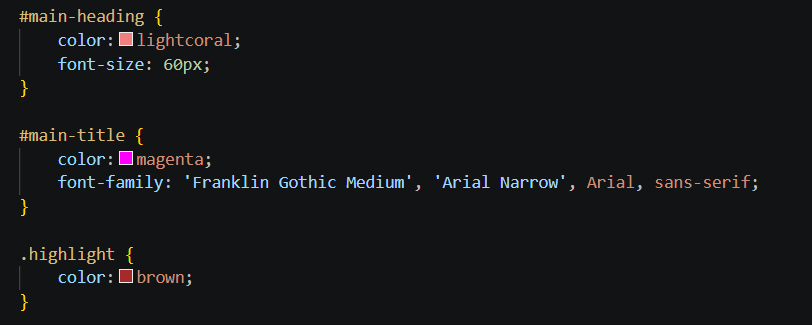

---

# Part 4 - Intermediate CSS

## Step 15 - Favicon

I added a custom favicon to the webpage.

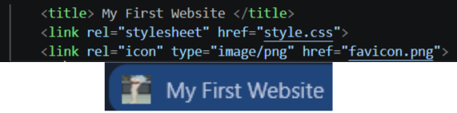

## Step 16 - HTML Divs

I used `div` elements to divide the page into a header, main content and footer.

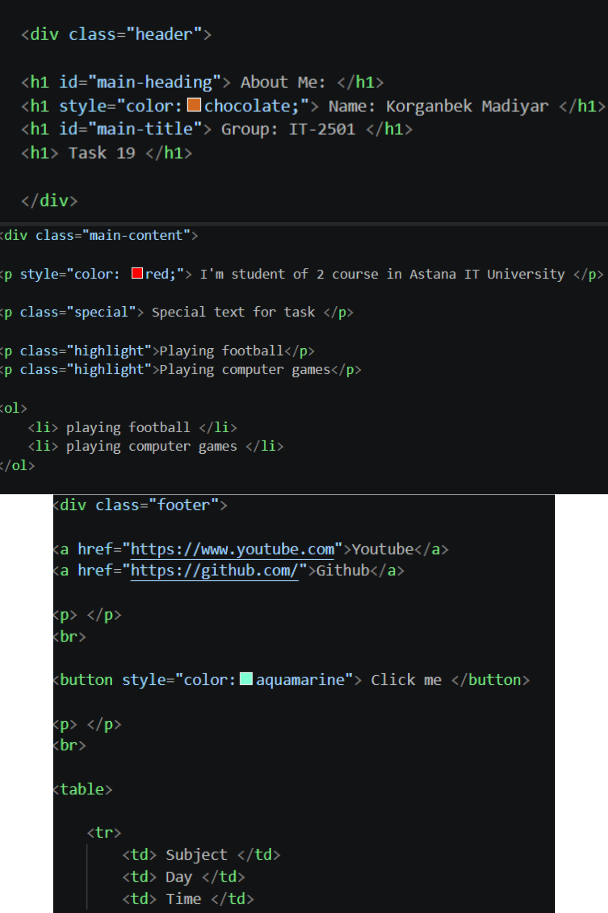

## Step 17 - Box Model

I used borders, margins and padding to control spacing and element sizes.

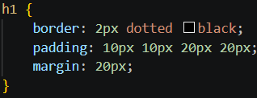

## Step 18 - CSS Positioning

I worked with static, relative and absolute positioning.

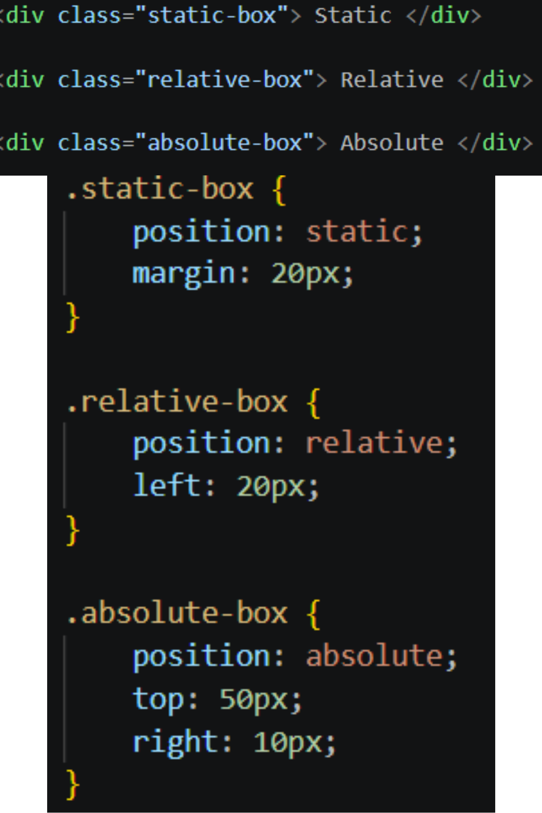

## Step 19 - CSS Sizing

I used different CSS units such as pixels, percentages and rem/em units.

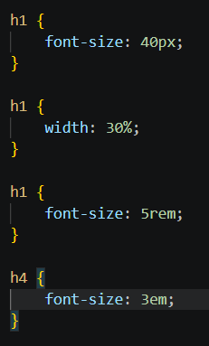

## Step 20 - Float and Clear

I created left and right floating boxes and used clear to control the layout.

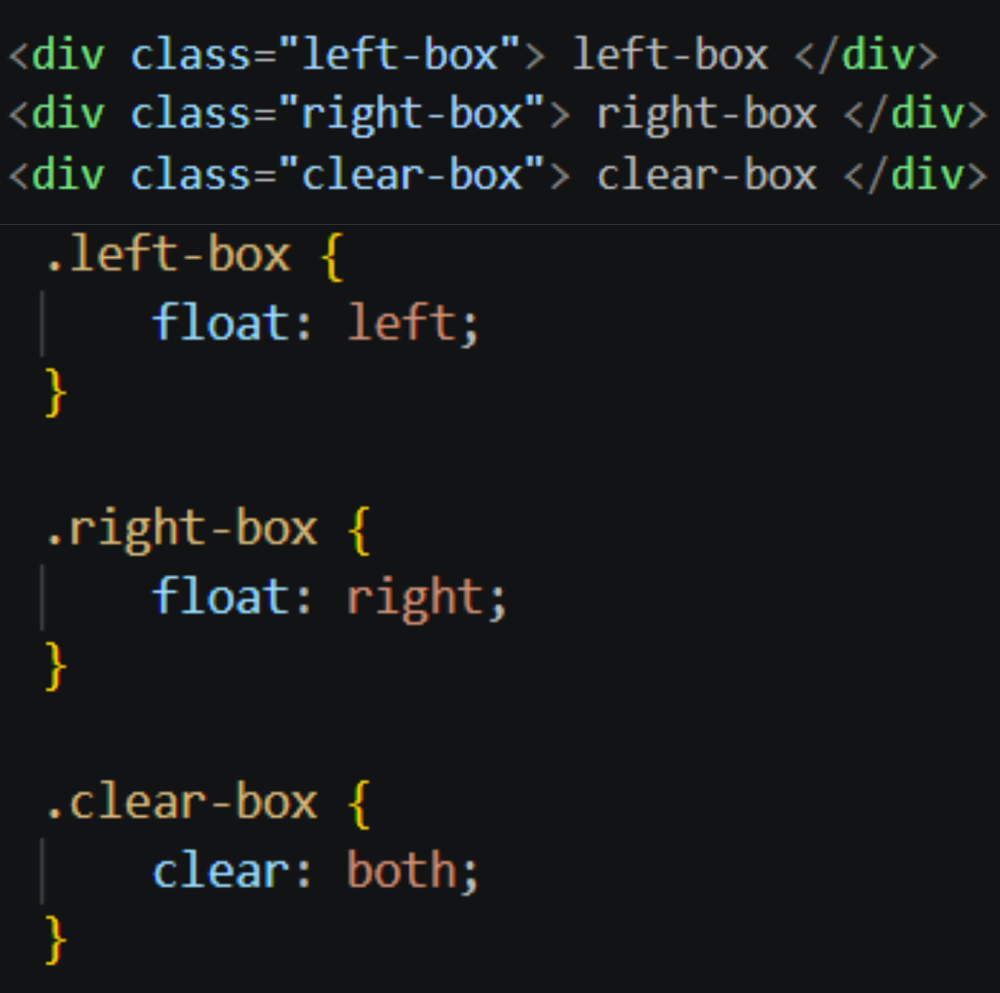

## Step 21 - Publish the Website

I published my webpage using GitHub Pages.

**Website:**  
https://mdrqnb.github.io/WebTech-Backend/backend.html

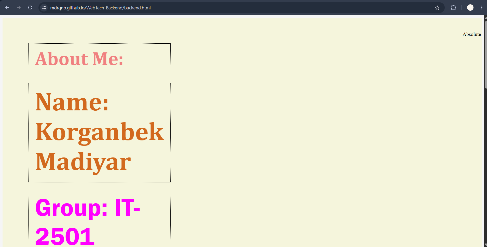

# Work Process

First, I created the HTML structure of the webpage and added personal information.
Then I added lists, an image, links, a button, tables, emojis and a form.
After that, I started working with CSS. I used inline CSS, internal CSS and an external stylesheet. I also practiced selectors, classes, IDs, the box model, positioning, sizing and floating elements.
Finally, I uploaded the project to GitHub and published the webpage using GitHub Pages.

# Final Reflection

This assignment helped me understand the basic structure of HTML and how CSS is used to style webpages.
I learned how to work with different HTML elements and how to connect an external CSS file to a webpage. I also learned more about margins, padding, borders, positioning and CSS units.
Publishing the website with GitHub Pages was also useful because I could see my webpage working online.